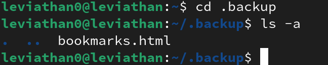

## Credentials
```
username: leviathan0
password: leviathan0
port: 2223
host: leviathan.labs.overthewire.org (176.9.9.172)
```
## Looking around 
once we are inside we can use `ls` to check what files are inside and since it's the `homedirectory`, we know that there should be something inside here because all datas are inside homedirectory:


and we see nothing!
let's use `-a` flag to check for hidden files and directories too:


and we see there is a rather interesting directory here: `.backup`

let's `cd` into it and see what's inside:



there is an interesting file here, `bookmarks.html`, let's `cat` and see what we can find there. we see that it's rather a big file, let's check and see if we can find anything using `grep` and checking for a `password` text inside:


nice! we found the password for leviathan1.