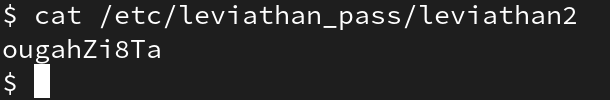

## Credentials
```
username: leviathan1
password: rioGegei8m
port: 2223
host: leviathan.labs.overthewire.org (176.9.9.172)
```
## Looking around
once we are inside let's `ls -l` to see what files are inside:


we see that there is a file named `check` inside the `home` directory that has its `s` set and the group users can execute it and we are in that group so let's execute it:


we see that it compares passwords but surely it's hardcoded, maybe we can check library calls to see if we can find anything useful:


we see that there is a function named `strcmp`, with a bit of googling we find that it compares two strings so let's see if `sex` will work as a password:


the password was correct and we got a shell, let's see whose shell is it:


seems that we have the shell of `leviathan2` user. as we know passwords are stored in `/etc/leviathan_pass` folder so let's grab the password from there:



and we found the password: `ougahZi8Ta`